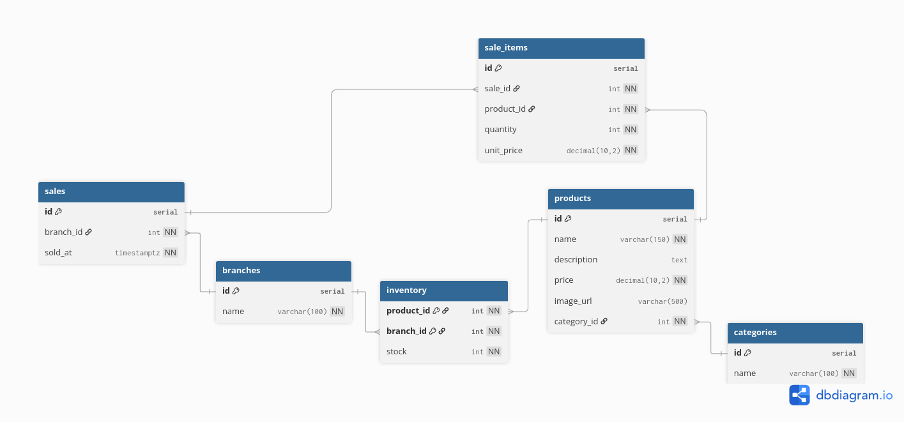
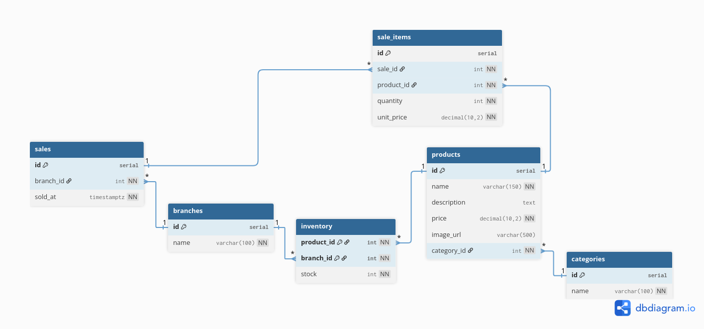

# Diagrama Entidad-Relación 

Se presenta el modelo de datos de la prueba técnica, enfocado en catálogo, inventario por sucursal, ventas y reporte de productos más vendidos

## Vista rápida
La siguiente imagen muestra una vista simple del modelo con las tablas principales:

--

## Vista detallada
La siguiente imagen incluye relaciones y cardinalidades:

--

También se incluye versión PDF para revisión:

- [Ver ER en PDF](./Diagrama-ER.pdf)

## Entidades principales
- **categories**: son las categorías del catálogo
- **branches**: sucursales de la compañia
- **products**: productos del catálogo con precio único a nivel empresa
- **inventory**: existencias por combinación de "producto + sucursal"
- **sales**: cabecera de venta 
- **sale_items**: detalle de la venta

## Relaciones y cardinalidades
- **categories 1:N products**
  - una categoría tiene muchos productos
  - un producto pertenece a una sola categoría
- **products N:M branches** 
  - se resuelve con la existencia de "inventory"
  - un producto puede tener stock en muchas sucursales
  - una sucursal maneja stock de muchos productos
- **branches 1:N sales**
  - una sucursal registra muchas ventas
  - cada venta pertenece a una sucursal
- **sales 1:N sale_items**
  - una venta tiene uno o más ítems
  - cada ítem pertenece a una venta
- **products 1:N sale_items**
  - un producto puede aparecer en muchas líneas de venta

> [!IMPORTANT]
> Se usa tabla `inventory` con clave compuesta de `product_id` y `branch_id` para evitar duplicados de stock por sucursal
> Se guarda `unit_price` en `sale_items` para conservar el precio histórico al momento de la venta
> `sold_at` se registra con zona horaria para soportar reportes por rango de fechas
> Se aplican restricciones de integridad como `NOT NULL`, `UNIQUE`, `CHECK` y `FK` para proteger reglas del negocio
